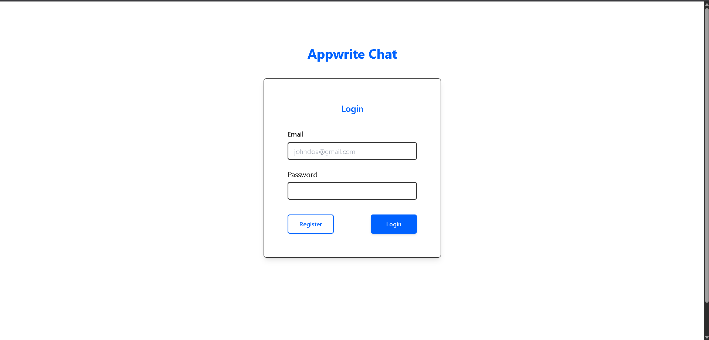

# Angular Chat Application with Appwrite as Backend




<a href='https://ko-fi.com/T6T14PGKO' target='_blank'></a>

## Table of Contents
- [Overview](#overview)
- [Features](#features)
- [Demo](#demo)
- [Installation](#installation)
- [Configuration](#configuration)
- [Usage](#usage)
- [Contributing](#contributing)
- [License](#license)

## Overview
This is a real-time chat application built with Angular and Appwrite. The application allows users to send and receive messages in real-time, leveraging Appwrite's powerful backend services for user authentication, database management, and real-time updates.

## Features
- User authentication (sign up, login, logout)
- Real-time messaging
- Responsive UI
- Secure communication
- User-friendly interface

## Demo
[Go to demo app](https://ng-appwrite-chat.vercel.app)

## Installation
To run this project locally, follow these steps:

### Prerequisites
- Node.js (v20 or higher)
- Angular CLI
- Appwrite server or an account in Appwrite Cloud

### Clone the Repository
```sh
git clone https://github.com/your-username/angular-appwrite-chat.git
cd angular-appwrite-chat
```

## Install dependencies
``` sh 
npm install
```

## Configuration
Create an .env file in the root directory and add your Appwrite configuration details:
``` sh
ENDPOINT=https://cloud.appwrite.io/v1 # or your own Appwrite server
PROJECT_ID=your-project-id
DATABASE_ID=database-id
COLLECTION_ID=messages-collection
```

### Create messages collection
Create a new collection in your database to store messages, the collection will have the following fields:
<br>
    - user: string
    - message: string

### Running the Application
Start the development server:
``` sh
npm run start
```

## Usage
- Sign up or log in to the application.
- Start a new chat or join an existing chat room.
- Send and receive messages in real-time.

## Contributing
Contributions are welcome! Please follow these steps to contribute:

Fork the repository.
Create a new branch (git checkout -b feature/YourFeature).
Commit your changes (git commit -m 'Add some feature').
Push to the branch (git push origin feature/YourFeature).
Open a pull request.

## License
This project is licensed under the MIT License. See the LICENSE file for details.

